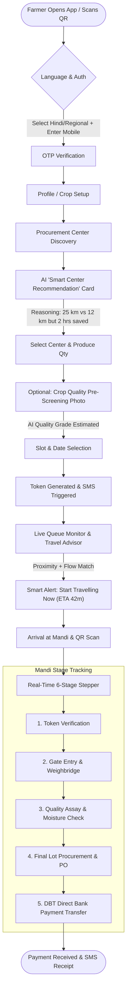
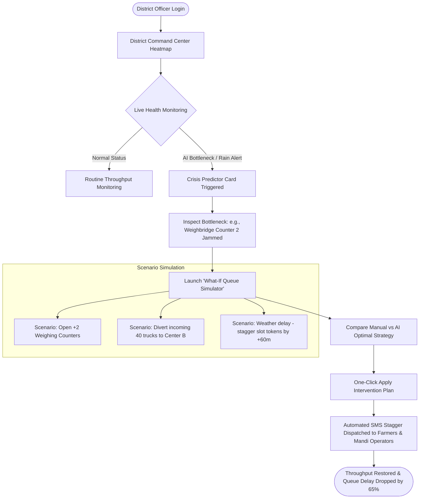

# KisanFlow (किसान प्रवाह) — UI/UX Design System & Specification
**Smart India Hackathon 2026 | AI-Powered Smart Queue & Agricultural Procurement Management System**

---

## 1. Design System & Foundational Principles

### 1.1 Dual-Persona Design Philosophy
KisanFlow addresses two radically distinct user profiles within a single unified ecosystem:
1. **Farmer App (Mobile-First)**: Low-cognitive load, high-contrast visual cues, large touch targets (min 56px), multi-lingual voice prompts (Hindi, Punjabi, Telugu, Tamil, Marathi, Bengali, English), audio-visual feedback for low-literacy users, and resilience to erratic rural connectivity.
2. **Officer Dashboard (Desktop-First / Tablet-Ready)**: High data density, instant anomaly detection, geospatial GIS heatmaps, real-time stage telemetry, predictive alerting, and scenario simulation with before-and-after operational impacts.

```
                  ┌─────────────────────────────────────────────────┐
                  │              KISANFLOW CORE SYSTEM              │
                  └────────┬───────────────────────────────┬────────┘
                           │                               │
            ┌──────────────▼──────────────┐ ┌──────────────▼──────────────┐
            │         FARMER APP          │ │      OFFICER DASHBOARD      │
            │  - Mobile-first (Android/PWA)│ │  - Desktop-first (Web/GIS)  │
            │  - Multilingual & Voice UX  │ │  - High Data Density        │
            │  - Big touch targets & audio│ │  - Live Heatmap & Simulators │
            │  - Low cognitive load       │ │  - AI Crisis Predictors     │
            └─────────────────────────────┘ └─────────────────────────────┘
```

---

### 1.2 Color Palette & Semantic Tokens

```
  PRIMARY BRAND           STATUS TRAFFIC LIGHT         SURFACE & NEUTRALS
  ┌──────────────┐        ┌──────────────┐ Green (Safe)┌──────────────┐ Dark Clay
  │ #1B5E20      │        │ #2E7D32      │ (< 40m wait)│ #1A1F16      │ (Header/Nav)
  │ Forest Green │        └──────────────┘             └──────────────┘
  ├──────────────┤        ┌──────────────┐ Yellow (Mod)├──────────────┤ Pure White
  │ #2E7D32      │        │ #F57F17      │ (40-90m)    │ #FFFFFF      │ (Cards)
  │ Krishi Green │        └──────────────┘             └──────────────┘
  ├──────────────┤        ┌──────────────┐ Red (Severe)├──────────────┤ Field Neutral
  │ #F9A825      │        │ #C62828      │ (> 90m / jam│ #F4F7F2      │ (Background)
  │ Harvest Gold │        └──────────────┘             └──────────────┘
```

| Token Name | Hex Code | Role / Usage |
| :--- | :--- | :--- |
| `color-primary-900` | `#0D3311` | Primary brand dark, high-contrast headings, active states |
| `color-primary-600` | `#2E7D32` | Primary buttons, success state, verified badges |
| `color-primary-100` | `#E8F5E9` | Card highlights, recommended badge background |
| `color-accent-amber`| `#F9A825` | Harvest Gold for token badges, token numbers, action cues |
| `color-status-green`| `#2E7D32` | Center Capacity Normal (< 50% capacity, wait < 30 mins) |
| `color-status-yellow`| `#F57F17`| Center Capacity Medium (50-80% capacity, wait 30-75 mins) |
| `color-status-red`  | `#C62828` | Center Capacity Jammed (> 80% capacity, wait > 75 mins) |
| `color-surface-bg`  | `#F4F7F2` | Farmer mobile background (reduces glare in direct sunlight) |
| `color-dashboard-bg`| `#0F172A` | Optional Dark Mode command center background |
| `color-card-surface`| `#FFFFFF` | Elevated UI cards with `0 2px 8px rgba(0,0,0,0.08)` shadow |

---

### 1.3 Typography System
- **Display / Headings**: `Outfit`, `Plus Jakarta Sans` (Heavy weights for numerals & token identifiers).
- **Body / Content**: `Noto Sans` (with preloaded glyphs for Devanagari, Gurmukhi, Telugu, Tamil, Kannada, Bengali).
- **Scale**:
  - `Hero Token Display`: 48px / Bold (Farmer active token number)
  - `H1 / Screen Title`: 24px / Semi-bold (Mobile), 32px / Bold (Dashboard)
  - `H2 / Section Title`: 18px / Medium (Mobile), 20px / Semi-bold (Dashboard)
  - `Body Regular`: 16px / Regular (Mobile minimum body for legibility in sunlight)
  - `Micro-Badge / Meta`: 12px / Medium (Dashboard metric tables)

---

### 1.4 Component Library Guidelines

1. **Large Action Buttons (`Btn-Hero-Kisan`)**: Minimum height of 56px, rounded corners (14px), with a high-contrast icon + bold dual-language text + optional speaker voice button.
2. **Audio-Cue Helper (`Voice-Speaker-Badge`)**: Placed on every key card (Token, Center Name, Status), tapping triggers audio narration in the selected regional language.
3. **Queue Health Pill (`Badge-Capacity`)**: 
   - `Green`: "खाली है (Smooth Flow) • 15 min wait"
   - `Yellow`: "मध्यम भीड़ (Moderate) • 45 min wait"
   - `Red`: "भारी जाम (Heavy Delay) • 2 hr wait"
4. **Interactive Stepper (`Kisan-Stepper`)**: 6 stages with bold icons (Ticket, Gate, Scale, Microscope, Stamp, Bank Rupee), color-coded with dynamic timestamp and active pulse animation.

---

## 2. User Journey & Architecture Flows

### 2.1 Farmer Journey Flowchart


---

### 2.2 Officer & District Command Center Flowchart


---

## 3. Farmer Mobile App — Screen Specifications (Figma-Ready)

---

### Screen 1: Mobile Login & Language Selection
- **Target Persona**: Rural farmer, varying literacy levels, multi-dialect users.
- **Visual Structure & Layout**:
  - **Top Bar**: Voice assistant mascot ("Kisan Saathi") avatar with audio toggle button: *"अपनी भाषा चुनें / Select Language"*.
  - **Language Grid (2x3 Large Tiles)**:
    - `[🇮🇳 हिन्दी]` `[🌾 ਪੰਜਾਬੀ]` `[🚜 తెలుగు]`
    - `[🌱 தமிழ்]` `[🌾 मराठी]` `[🇬🇧 English]`
    - *Selected tile gets 3px Forest Green border, checkmark icon, and plays sample voice greeting.*
  - **Hero Input Card**:
    - Title: **"किसान मोबाइल नंबर दर्ज करें"** (Enter Mobile Number)
    - Input: Extra large digits display (+91 [ _____ _____ ]), numeric keypad popup by default.
    - Button: **"ओटीपी भेजें / Get OTP"** (Green 56px height, high-contrast, speaker icon).
  - **OTP Verification Modal / Step**:
    - 4 large auto-focus boxes with 60-second voice-assisted resend timer.
    - Automatic SMS detection feature with zero typing requirement.

---

### Screen 2: Farmer Profile & Land Setup
- **Visual Structure & Layout**:
  - **Progress Bar**: Step 1 of 2 (Pill format).
  - **Input Sections**:
    - `Farmer Name`: Text input with microphone button for voice typing.
    - `District / Village Selection`: Dropdown with GPS "Use My Location" instant autofill.
    - `Primary Crop Selector`: Visual cards with crop photography (Wheat / Gehun, Paddy / Dhan, Mustard / Sarson, Cotton / Kapas).
    - `Bank Account / Aadhaar Link Status`: Green shield with *"DBT Payment Verified"*.
  - **Primary Action**: **"आगे बढ़ें / Continue"** (Full-width button).

---

### Screen 3: Nearby Procurement Centre Discovery
- **Visual Structure & Layout**:
  - **Header**: Search bar + GPS auto-detected location (*"समस्तीपुर, बिहार (5 centres near you)"*).
  - **Interactive Mini-Map**: Showing current location and 5 Mandis color-coded with green/yellow/red pulsating pins.
  - **Filter Chips**: `All`, `Shortest Wait`, `Nearest Distance`, `Fastest DBT Settlement`.
  - **Center List Cards**:
    - **Card 1 (Mandi A)**:
      - Title: **कपूरथला मुख्य मंडी (Kapurthala Main Mandi)**
      - Metrics Grid: `Distance: 12 km` | `Live Queue: 18 Farmers` | `Est. Wait: 35 mins`
      - Capacity Status: Green Pill *"सुचारू प्रवाह (Fast Track)"*
      - Today's MSP Rate for Crop: ₹2,275 / Quintal
      - CTA: `[ स्लॉट बुक करें / Book Slot ]`
    - **Card 2 (Mandi B)**:
      - Title: **नवां पिंड उप-केंद्र (Nawan Pind Sub-Center)**
      - Metrics Grid: `Distance: 7 km` | `Live Queue: 64 Farmers` | `Est. Wait: 2 hr 10 min`
      - Capacity Status: Red Pill *"भारी भीड़ (High Congestion)"*
      - Warning: *"Weighbridge 1 is currently undergoing maintenance."*

---

### Screen 4: AI "Smart Recommended Centre" Card
- **Visual Structure & Layout**:
  - **Highlight Container**: Golden gradient border with sparkling AI Badge `✨ AI KisanFlow Smart Recommendation`.
  - **Hero Decision Header**: *"Recommended: Go to Rajpura Mandi instead of Patiala Center"*.
  - **Reasoning Comparison Matrix (Visual Card)**:
    | Parameter | Patiala Center (Nearest) | Rajpura Mandi (AI Choice) |
    | :--- | :--- | :--- |
    | **Distance** | 8 km | 18 km (+10 km) |
    | **Current Line** | 82 Tractors / Trucks | 11 Tractors |
    | **Estimated Wait**| 3 Hours 45 Mins | 25 Mins |
    | **Net Time Saved**| **0 min** | **🎉 2 Hours 50 Mins Saved** |
    | **Diesel / Fuel** | ₹180 extra travel | Saves ₹650 in tractor idle fuel |
  - **Voice Summary Button**: *"सुनिए AI की सलाह (Listen to AI advice)"*.
  - **One-Tap Action**: **"AI अनुशंसित केंद्र चुनें (Accept & Book AI Center)"**.

---

### Screen 5: Crop Photo AI Pre-Screening Screen
- **Visual Structure & Layout**:
  - **Header**: *"फसल की गुणवत्ता जांच (Crop Quality Pre-Check)"*.
  - **Camera Viewfinder Box**: Large rounded rectangle with overlay grid for grain sample alignment.
  - **Sample Guidance**: Two visual thumbnail chips:
    - ✅ *सही तरीका (Spread grains evenly on white paper)*
    - ❌ *गलत तरीका (Dark / blurry shadow)*
  - **Interactive Action**: Big Circular Shutter Button + "गैलरी से चुनें (Upload from Gallery)".
  - **Instant AI Assessment Result Sheet**:
    - Estimated Quality Grade: **Grade A (Premium)**
    - Estimated Moisture Content: **11.4% (Optimal: < 12%)**
    - Impurity / Foreign Matter: **1.2% (Passes Standards)**
    - Status Badge: `✅ Ready for Direct Mandi Procurement`
    - Voice Narration: *"आपकी फसल नमी मानकों के अनुसार बिल्कुल सही है।"*

---

### Screen 6: Slot Booking & Produce Flow
- **Visual Structure & Layout**:
  - **Date Selector**: Horizontal scroll calendar (Today, Tomorrow, Day 3) with traffic indicators on each date.
  - **Dynamic Time Slot Selector (4 Horizontally Stacked Cards)**:
    - `08:00 AM - 10:00 AM`: 🔴 High Rush (95% Booked)
    - `10:00 AM - 12:00 PM`: 🟡 Moderate (60% Booked)
    - `12:00 PM - 02:00 PM`: 🟢 Optimal / Recommended (20% Booked - Bonus Fast Weighbridge lane)
    - `02:00 PM - 04:00 PM`: 🟢 Fast Track (30% Booked)
  - **Quantity Input**: Slider & Numeric counter in Quintals (e.g., `45 क्विंटल / Quintals`).
  - **Vehicle Type Picker**: Icons for `[Tractor Trolley]`, `[Mini Truck]`, `[Bullock Cart / Tempo]`.
  - **Summary Footer Bar**: Fixed bottom bar with **"पुष्टि करें और टोकन प्राप्त करें (Confirm & Get Token)"**.

---

### Screen 7: Live Dynamic Token & Travelling Advisor
- **Visual Structure & Layout**:
  - **Hero Token Card (High Visual Weight)**:
    - Golden Ticket styling with barcode & QR code.
    - **Token Number**: `#KF-2026-084` (Font Size: 48px Bold).
    - Assigned Center: **राजपुरा अनाज मंडी - गेट नं. 2**
    - Assigned Slot: **आज दोपहर 12:30 PM - 01:00 PM**
  - **Live Queue Position Tracker**:
    - *"Currently Serving: Token #KF-072"*
    - *"Your Turn in: 12 Farmers ahead of you (~28 mins)"*
  - **Smart Traveling Alert Banner (Predictive Push Feature)**:
    - Pulsating Blue Banner with Navigation Icon:
    - **"🔔 अब घर से निकलें! (Start Traveling Now!)"**
    - Subtext: *"Your travel time is 22 mins. If you leave now, you will reach directly at zero-wait gate entry."*
  - **Action Buttons**: `[ 🗺️ Google Maps Navigation ]` `[ 🔊 Audio Token Status ]` `[ ❌ Reschedule Slot ]`.

---

### Screen 8: 6-Stage Real-Time Procurement Stepper & DBT Tracker
- **Visual Structure & Layout**:
  - **Vertical Animated Stepper**:
    1. `1. टोकन सत्यापन (Token Verified at Gate)` — 🟢 Complete (12:35 PM)
    2. `2. धर्मकांटा वजन (Gross Weighbridge)` — 🟢 Complete (12:48 PM, Weight: 4,850 kg)
    3. `3. गुणवत्ता एवं नमी परीक्षण (Quality & Moisture Assay)` — 🟢 Complete (Grade A, 11.2% Moisture)
    4. `4. फसल उतराई एवं शुद्ध वजन (Tare Unloading & Net Weight)` — 🟢 Complete (Net: 4,200 kg / 42 Quintals)
    5. `5. खरीद आदेश एवं दर स्वीकृति (PO & J-Form Generated)` — 🟢 Complete (Total: ₹95,550 @ ₹2,275/Q)
    6. `6. डीबीटी बैंक भुगतान (Direct Bank Transfer DBT)` — 🟡 In Processing (Bank Ref: `DBT-SBI-883921`)
  - **Digital J-Form / Receipt Card**:
    - Download PDF Button + SMS Receipt link.
  - **Help / SOS Button**: *"कोई समस्या है? मंडी अधिकारी से बात करें (Call Mandi Helpdesk)"*.

---

## 4. Officer / District Command Dashboard — Wireframe & Screen Specs

---

### View 1: District Command Center Overview (GIS Live Heatmap)
- **Target Persona**: District Magistrate (DM), District Agriculture Officer (DAO), Mandi Board Supervisors.
- **Visual Hierarchy & Layout (Desktop 1920x1080 Grid)**:
  - **Top KPI Metrics Ribbon**:
    - `Total Active Mandis`: **14 / 14 Operational**
    - `Total Farmers Today`: **3,420 Scheduled | 2,890 Processed | 530 In-Queue**
    - `Procurement Volume`: **14,280 MT Procured (84% of daily target)**
    - `Avg. Turnaround Time (TAT)`: **34 Minutes (Target < 45m)**
    - `Crisis Severity Index`: **1 Alert Pending Action**
  - **Main Canvas (Split 65% / 35%)**:
    - **Left (65%): Geospatial Leaflet/Mapbox GIS Heatmap**:
      - Real-time pins of all district procurement centers.
      - Heatmap layers: Traffic density, arrival surge clusters, rainfall radar overlay.
      - Interactive center hover cards showing live capacity %, current queue, and active bottleneck.
    - **Right (35%): Live Center Queue Barometer List**:
      - Stacked list of all 14 centers sorted by congestion score.
      - Direct drill-down button: `[ Manage Center ]` `[ Trigger Diversion ]`.

---

### View 2: Center-Level Live Queue & Counter Telemetry
- **Visual Structure & Layout**:
  - **Center Header**: *"Kapurthala Main Mandi — Live Telemetry (Updated 3s ago)"*.
  - **Stage-Wise Live Funnel Flow**:
    ```
    [ Gate Entry ] ──► [ Weighbridge (3 Counters) ] ──► [ Quality Lab (2 Desks) ] ──► [ Unloading Bay ] ──► [ DBT Accounts ]
       8 In Queue          24 In Queue (Bottleneck)          4 In Testing                6 Unloading          12 Processing
       Rate: 40/hr         Rate: 18/hr (Target: 30/hr)       Rate: 35/hr                 Rate: 45/hr          Rate: 50/hr
    ```
  - **Active Counter Grid**:
    - Counter 1 (Weighing Scale A): 🟢 Active (Operator: Rajesh K. | 92 loads processed)
    - Counter 2 (Weighing Scale B): 🔴 Offline / Fault Detected (Zero throughput in 18 mins)
    - Counter 3 (Weighing Scale C): 🟢 Active (Operator: Sunita R. | 88 loads processed)
  - **Action Button**: `[ Open Emergency Weighbridge Lane 4 ]` `[ Dispatch Field Mechanic ]`.

---

### View 3: AI Crisis Predictor & Early Warning Cards
- **Visual Structure & Layout**:
  - **Floating / Sticky Alert Panel**: Glowing Red/Amber border.
  - **Alert Card Example**:
    - **Alert Badge**: `⚠️ CRITICAL: Bottleneck Influx Predicted at 02:30 PM`
    - **Center**: Jalandhar East Mandi.
    - **Root Cause Analysis (AI Engine)**:
      - 1) 45 unbooked tractor arrivals detected via highway toll FASTag API.
      - 2) Sudden unseasonal rain forecast at 03:15 PM (85% probability).
      - 3) Weighbridge capacity will exceed by **220%** if no action taken.
    - **AI Recommended Interventions**:
      - Option 1: Divert 30 incoming slot notifications to Kartarpur Sub-Center (6 km away).
      - Option 2: Extend Mandi operating hours by +90 minutes and open auxiliary covered sheds.
    - **Direct CTA**: `[ Execute AI Recommendation (One-Click) ]` `[ Custom Override ]`.

---

### View 4: Bottleneck Detection & Stage Health Analyzer
- **Visual Structure & Layout**:
  - **Stage Health Health Matrix**:
    - Columns: `Stage Name`, `Active Counters`, `Avg Service Time`, `Queue Length`, `Status Health`, `Trend`.
    - Row 1: Gate Token Scan | 4 Gates | 45 sec/farmer | 6 waiting | 🟢 98% Optimal
    - Row 2: Gross Weighbridge | 2 Scales | 6.5 min/vehicle | 38 waiting | 🔴 High Delay (+4.2m over SLA)
    - Row 3: Grain Quality & Moisture | 3 Desks | 3.0 min/lot | 5 waiting | 🟢 94% Optimal
    - Row 4: Unloading & Stacking | 8 Bays | 8.0 min/trolley | 7 waiting | 🟢 91% Optimal
    - Row 5: J-Form & DBT Payout | 4 Operators | 2.0 min/farmer | 11 waiting | 🟡 Normal
  - **Diagnostic Drilldown Chart**: Interactive 24-hour line chart plotting Arrival Rate vs Processing Capacity.

---

### View 5: "What-If" Queue & Flow Simulator Screen
- **Visual Structure & Layout**:
  - **Top Parameter Sliders (Simulation Controls)**:
    - Slider 1: `Incoming Farmer Volume (+/- %)`: `[ -50% ────●──── +50% ]` *(Selected: +30% Surge)*
    - Slider 2: `Active Weighbridge Counters`: `[ 1 ── 2 ──● 3 ── 4 ]` *(Selected: 3)*
    - Slider 3: `Moisture Rejection Threshold`: `[ 10% ────●── 14% ]` *(Selected: 12%)*
    - Slider 4: `Weather Event Trigger`: `[ None | Rain at 3 PM | Road Blockage ]`
  - **Before vs After Simulation Impact Graph (Dual Line Curve)**:
    - *Curve A (Current Plan)*: Queue peaks at 112 tractors at 03:30 PM (Average Wait: **185 minutes**).
    - *Curve B (Simulated Intervention)*: Queue peaks at 24 tractors (Average Wait: **28 minutes**).
  - **Simulation Scorecard**:
    - Projected Farmer Wait Time Reduction: **⬇ 84%**
    - Mandi Congestion Elimination: **100%**
    - Fuel & Carbon Wastage Prevented: **~1,240 Liters diesel saved**
  - **CTA**: `[ Apply Simulated Configuration to Live Mandi ]`.

---

### View 6: Officer Simulation Mode (Manual Planning vs AI Optimal)
- **Visual Structure & Layout**:
  - **Dual Split Screen**:
    - **Left Panel (Officer Manual Plan)**:
      - Officer manually assigns 500 farmers across 4 centers.
      - Live metrics: 2 centers overloaded (Red), 1 underutilized (30% load).
      - Projected avg wait time: 74 mins.
    - **Right Panel (KisanFlow AI-Optimal Strategy)**:
      - Dynamic load balancing based on road transit speeds, vehicle types, and crop moisture urgency.
      - Load distributed evenly (65% across all 4 centers).
      - Projected avg wait time: **22 mins**.
      - Efficiency Gain: **+42% Throughput**.
  - **One-Click Merge Button**: `[ Adopt AI Strategy & Publish Schedule ]`.

---

### View 7: Resource Optimization & Field Action Dispatch
- **Visual Structure & Layout**:
  - **Live Resource Roster**:
    - Weighing Staff: 28 on duty | Moisture Analyzers: 16 active | Laborers (Palledars): 140 on field.
  - **Action Dispatch Modal**:
    - Target Center: Kapurthala Mandi.
    - Action Type: Stagger Notifications via SMS / WhatsApp.
    - Target Audience: 60 farmers with tokens booked for 02:00 PM - 04:00 PM.
    - Message Template Preview (Editable in Hindi/Punjabi):
      *"प्रिय किसान भाई, मौसम और भीड़ को देखते हुए आपका नया समय 03:30 PM है। कृपया 03:15 PM पर ही आएं।"*
    - Button: `[ Send Automated Multilingual SMS Broadcast (60 Farmers) ]`.

---

## 5. Accessibility, Multimodal & Offline Protocols

| Feature | Implementation Specification |
| :--- | :--- |
| **Voice-First Interaction** | Integrated Web Speech API / Bhashini AI model for Hindi, Punjabi, Marathi, Telugu, Tamil voice recognition and text-to-speech audio guidance on all screens. |
| **Direct Sunlight Outdoor Mode**| High-contrast UI theme with pure black typography on clean white/sand surfaces (`#F4F7F2`), zero subtle gray texts below 4.5:1 WCAG contrast ratio. |
| **Low Connectivity / 2G PWA** | LocalStorage / IndexedDB token caching. If offline, the app displays the cached QR token and triggers an SMS-based USSD fallback (`*99#` or SMS to `56161`). |
| **Haptic & Audio Signals** | Haptic vibrations on button tap and auditory chimes on token progression for visually impaired and low-literacy users. |

---
*Created for KisanFlow — Smart India Hackathon 2026 Submission.*
